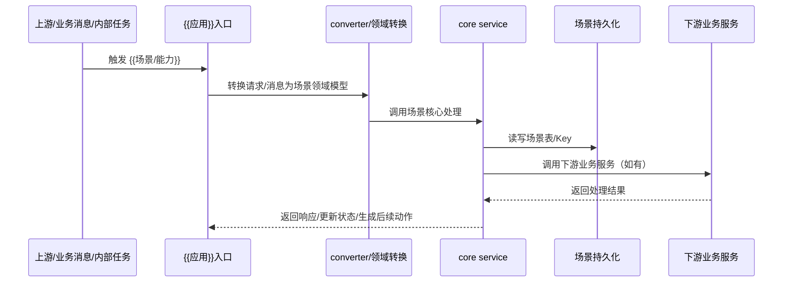

# Page Templates — Git-only 页面与日志模板

模板中 `{{...}}` 为占位符。所有 wiki 页面均为本地 Markdown，内部链接统一使用相对 Markdown 链接。

---

## raw 引用模板

**文件**: `raw/{{分类}}/{{slug}}.md`

```markdown
---
type: raw_ref
title: "{{原始标题}}"
raw_category: "{{分类}}"
source_kind: "{{lark_doc|lark_wiki|external_url|local_file|note}}"
lark_url: "{{飞书地址，可选}}"
doc_id: "{{doc_id，可选}}"
wiki_token: "{{wiki_token，可选}}"
obj_type: "{{docx|file|sheet|url|note}}"
modules: []
architecture_layers: []
business_scenarios: []
platform_capabilities: []
systems: []
imported_at: "{{YYYY-MM-DD HH:mm}}"
updated_at: "{{YYYY-MM-DD HH:mm}}"
---

# {{原始标题}}

- 原始地址：{{URL 或路径}}
- 备注：本文件只保存 raw 引用，不保存原文。
```

---

## Source 摘要模板

**文件**: 推荐 `wiki/sources/{{分类}}/{{原始文档名}}.md`；文件名保留原始文档名，仅清理文件系统非法字符。历史仓库可兼容 `wiki/sources/{{slug}}.md`。Source 是 raw 的关键摘要 / 索引，不是原文备份，不保留 raw 全量章节、全量表格、全量字段或完整流程。

```markdown
---
type: source
title: "Source：{{原始文档名}}"
raw_ref: "../../../raw/{{分类}}/{{raw_slug}}.md"
raw_category: "{{分类}}"
modules: []
architecture_layers: []
business_scenarios: []
platform_capabilities: []
systems: []
created_at: "{{YYYY-MM-DD HH:mm}}"
updated_at: "{{YYYY-MM-DD HH:mm}}"
---

# Source：{{原始文档名}}

## 元数据

- 文档名：{{原始文档名}}
- 原始来源：[{{原始文档名}}](../../../raw/{{分类}}/{{raw_slug}}.md)
- 原始素材目录：`raw/{{分类}}`
- Raw 分类：`raw/{{分类}}`
- 关联：{{相对 Markdown 链接列表}}

## 摘要

{{3-5 句话概括核心观点}}

## 关键要点

- {{要点 1}}
- {{要点 2}}
- {{要点 3}}

## 业务分层提取

- 平台系统：{{modules}}
- 业务场景：{{business_scenarios}}
- 能力 / 规则 / 流程：{{platform_capabilities}}
- 应用/系统：{{systems}}
- 数据对象：{{data}}
- 技术实现：{{implementations}}

## 证据与不确定性

- 证据：{{证据}}
- 待确认：{{待确认}}
- 来源冲突：{{无 / 用户确认后的冲突或版本边界说明；明显冲突未确认前不得写成确定结论}}
```

---

## Module 模板

**文件**: `wiki/modules/{{module_slug}}.md`

```markdown
---
type: module
title: "Module: {{计费|结算}}"
created_at: "{{YYYY-MM-DD HH:mm}}"
updated_at: "{{YYYY-MM-DD HH:mm}}"
---

# Module: {{计费|结算}}

## 范围与边界

- 覆盖范围：{{覆盖哪些计费/结算流程、对象、角色、入口}}
- 不覆盖：{{明确排除}}

## 核心场景

- [Scenario: {{场景}}](../scenarios/{{scenario_slug}}.md)

## 能力地图

- 能力 / 规则 / 流程：[PlatformCapability: {{能力}}](../platform-capabilities/{{platform_capability_slug}}.md)
- 承载应用：[Application: {{PSM}}](../applications/{{application_slug}}.md)

## 证据来源

- [Source：{{标题}}](../sources/{{source_slug}}.md)
```

## Scenario 模板

**文件**: `wiki/scenarios/{{业务场景或专题}}.md`

Scenario 承载计费/结算业务场景和长期查询入口。它是“专题入口 / 索引页”，适合计费规则生效、账单生成、结算单生成、对账差异、差错补偿这类由多份 Source 支撑、需要长期作为查询入口的内容。Scenario 只沉淀关键摘要、覆盖材料、阅读路径、关键决策/边界提醒和证据链接，不复制 raw 全量信息。新增 Scenario 前必须先按第一性原理向用户说明并确认。

```markdown
---
type: scenario
title: "Scenario: {{业务场景或专题}}"
modules: ["{{计费|结算}}"]
created_at: "{{YYYY-MM-DD HH:mm}}"
updated_at: "{{YYYY-MM-DD HH:mm}}"
---

# Scenario: {{业务场景或专题}}

## 元信息

- 类型：scenario
- 主题范围：{{这个场景/专题覆盖的问题域；例如费用项计费、账单生成、结算出款、对账差异等}}
- 证据边界：{{本页只基于哪些已摄入 Source 归纳；哪些结论不可外推；证据不足点}}
- 当前状态：{{草稿 / 已确认 / 待补充}}

## 摘要

{{3-5 句话概括这个 Scenario 为什么存在、覆盖哪些关键问题域、读者应如何使用它。不要复制 raw 的完整背景、流程或方案细节。}}

## 覆盖材料

| 问题域 | 相关 Source | 说明 |
|---|---|---|
| {{问题域 1}} | [Source：{{原始文档名}}](../sources/{{分类}}/{{原始文档名}}.md) | {{一句话说明该 Source 在本 Scenario 中的用途}} |

## 推荐阅读路径

- [Source：{{原始文档名}}](../sources/{{分类}}/{{原始文档名}}.md)：{{为什么先读它}}

## 关键决策 / 边界提醒

- {{关键决策或边界提醒 1}}
- {{关键决策或边界提醒 2}}

## 可复用判断框架

| 评估问题 | 说明 | 关联 Source |
|---|---|---|
| {{问题 1}} | {{用一句话说明如何判断}} | [Source：{{原始文档名}}](../sources/{{分类}}/{{原始文档名}}.md) |

## 术语与边界

| 术语 | 在本场景中的含义 | 易混淆点 |
|---|---|---|
| {{术语 1}} | {{含义}} | {{易混淆点}} |

## 关联能力 / 规则 / 流程

- [PlatformCapability: {{能力}}](../platform-capabilities/{{platform_capability_slug}}.md) 或 `待确认`

## 承载应用

- [Application: {{PSM}}](../applications/{{application_slug}}.md) 或 `待确认`

## 关联数据

- [Data: {{MySQL表/Redis Key/索引}}](../data/{{data_slug}}.md) 或 `待确认`

## 关键实现

- [Implementation: {{技术实现}}](../implementations/{{implementation_slug}}.md) 或 `待确认`

## 证据来源

- [Source：{{原始文档名}}](../sources/{{分类}}/{{原始文档名}}.md)

## 不确定性

- {{不确定点 1}}
- {{不确定点 2}}

## 变更记录

| 时间 | 变更 | 来源 |
|---|---|---|
| {{YYYY-MM-DD HH:mm}} | 创建页面 | [Source：{{原始文档名}}](../sources/{{分类}}/{{原始文档名}}.md) |
```

## PlatformCapability 模板

**文件**: `wiki/platform-capabilities/{{平台能力}}.md`

PlatformCapability 承载计费/结算平台对外或业务可复用的能力、规则和流程，也承载偏能力定义、关键机制、边界、易混淆点、相关能力关系的内容。新增 PlatformCapability 前必须先按第一性原理向用户说明并确认。

```markdown
---
type: platform_capability
title: "PlatformCapability: {{能力/规则/流程}}"
modules: ["{{计费|结算}}"]
created_at: "{{YYYY-MM-DD HH:mm}}"
updated_at: "{{YYYY-MM-DD HH:mm}}"
---

# PlatformCapability: {{能力/规则/流程}}

## 能力定义

{{面向业务/产品/接口使用方的能力定义。说明这个能力对外提供什么、解决什么问题。}}

## 所属平台系统

- [Module: {{计费|结算}}](../modules/{{module_slug}}.md)

## 适用场景

- [Scenario: {{业务场景}}](../scenarios/{{scenario_slug}}.md)

## 接口 / 入口

| 入口类型 | 名称 | 承载 PSM | 说明 | 来源 |
|---|---|---|---|---|
| RPC / HTTP / MQ / OpenAPI / 定时任务 | {{接口名/任务名}} | [Application: {{PSM}}](../applications/{{application_slug}}.md) | {{说明}} | [Source：{{原始文档名}}](../sources/{{分类}}/{{原始文档名}}.md) |

## 核心规则

- {{规则 1}}
- {{规则 2}}

## 计费/结算证据要求

- 金额 / 币种 / 主体 / 账期 / 费用项 / 费率 / 规则版本 / 结算周期 / 状态：{{对应 Source/raw；没有证据则写待确认}}

## 能力边界

- 负责：{{能力负责什么}}
- 不负责：{{不属于该能力的内容}}
- 容易混淆：{{和哪些能力容易混淆}}

## 关键机制

- {{机制 1}}
- {{机制 2}}

## 与相关能力的关系

| 相关能力 | 关系 |
|---|---|
| {{能力 A}} | {{关系说明}} |

## 承载应用

- [Application: {{PSM}}](../applications/{{application_slug}}.md) 或 `待确认`

## 边界与不确定性

- 不覆盖：{{不属于该平台能力的内容}}
- 待确认：{{证据不足的点}}

## 证据来源

- [Source：{{原始文档名}}](../sources/{{分类}}/{{原始文档名}}.md)
```

## Application 模板

**文件**: `wiki/applications/{{application_slug}}.md`

PSM 维度 Application 页面默认参考用户提供的 PSM 梳理模板组织：先给 Summary、代码仓库、核心职责、主要能力、上下游与边界、典型场景，再保留知识库跨层追踪章节。无证据的段落写“待确认”，不要编造。

```markdown
---
type: application
title: "Application: {{PSM}}"
systems: ["{{PSM}}"]
repo: "{{代码仓库 URL，可选}}"
created_at: "{{YYYY-MM-DD HH:mm}}"
updated_at: "{{YYYY-MM-DD HH:mm}}"
---

# Application: {{PSM}}

## Summary

{{用 1 段说明该 PSM 的定位、所属平台系统、主要入口职责、核心编排/处理职责、关键下游。}}

## 代码仓库

- Repo: {{代码仓库 URL；没有证据则写“待确认”}}

## 核心职责

1. **{{职责项 1}}**
   - {{职责细节}}
2. **{{职责项 2}}**
   - {{职责细节}}

## 主要能力

### {{能力分组 1}}

- {{能力说明}}
- {{入口 / 接口 / 消息 / 任务等证据}}

## 上下游与边界

> PSM 维度依赖优先基于 Source、代码仓库中的 RPC client、IDL、config、Overpass 引用等证据梳理；非 RPC 类入口按可见调用入口标注。

### 上游 / 调用方 PSM

- `{{上游 PSM}}`：{{调用关系、入口、场景；没有明确 PSM 时写“业务系统 / 待确认”}}

### 下游 / 依赖 PSM

- `{{下游 PSM}}`：{{依赖能力、接口、场景}}

### 边界说明

- {{该 PSM 负责什么}}
- {{该 PSM 不负责什么，相关职责归属哪个 PSM / 能力}}

## 典型场景

- {{场景 1}}
- {{场景 2}}

## 关联数据

- [Data: {{MySQL表/Redis Key/索引}}](../data/{{data_slug}}.md) 或 `待确认`

## 关联平台能力

- [PlatformCapability: {{能力/规则/流程}}](../platform-capabilities/{{platform_capability_slug}}.md) 或 `待确认`

## 证据来源

- [Source：{{标题}}](../sources/{{source_slug}}.md)
```

## Data 模板

**文件**: `wiki/data/{{data_slug}}.md`

```markdown
---
type: data
title: "Data: {{MySQL表/Redis Key/索引}}"
created_at: "{{YYYY-MM-DD HH:mm}}"
updated_at: "{{YYYY-MM-DD HH:mm}}"
---

# Data: {{MySQL表/Redis Key/索引}}

## 存储对象

| 类型 | 名称 | 所属系统/库 |
|---|---|---|
| MySQL 表 / Redis Key / 索引 | {{名称}} | {{系统/库}} |

## 来源

- [Source：{{标题}}](../sources/{{source_slug}}.md)

> 本页字段、索引和结构说明默认均来自上述 Source；字段表中不再逐行重复标注来源。若某个字段/索引来自不同 Source 或存在冲突，才在该行备注中单独说明。金额、币种、主体、账期、费用项、费率、规则版本、结算周期、账单/结算单状态等高风险字段必须能回溯 Source/raw。

## 字段 / Key 结构

| 字段 / Key 段 | 类型 | 含义 | 索引/约束 | 备注 |
|---|---|---|---|---|
| {{字段}} | {{类型}} | {{含义}} | {{索引/约束}} | {{可选；仅记录冲突、差异来源或待确认点}} |

## 变更条件

- 仅当 Source 明确给出表结构、索引、Redis Key，或明确涉及现有表/索引修正、新增表/Redis Key 时维护本页。
- 普通领域对象、状态机、字段语义不放入本页；应放入 `implementations/` 并在有存储证据时链接回本页。

## 生产与消费

- 生产方：[Application: {{应用}}](../applications/{{application_slug}}.md)
- 消费方：{{消费方}}
```

## Implementation 模板

**文件**: `wiki/implementations/{{implementation_slug}}.md`

```markdown
---
type: implementation
title: "Implementation: {{技术实现}}"
created_at: "{{YYYY-MM-DD HH:mm}}"
updated_at: "{{YYYY-MM-DD HH:mm}}"
---

# Implementation: {{技术实现}}

## 领域模型

{{领域对象、状态机、状态流转、核心规则等。若涉及落库字段，必须链接到 Data；没有明确表/Key 证据时写“存储证据：待确认”。}}

## 技术链路

{{链路、接口、幂等、事务、容灾、降级、灰度、可观测性等}}

## 关联能力与应用

- 平台能力：[PlatformCapability: {{能力/规则/流程}}](../platform-capabilities/{{platform_capability_slug}}.md)
- 应用：[Application: {{应用}}](../applications/{{application_slug}}.md)
- 关联存储：[Data: {{MySQL表/Redis Key/索引}}](../data/{{data_slug}}.md) 或 `待确认`

## 证据来源

- [Source：{{标题}}](../sources/{{source_slug}}.md)
```

## Map 模板

**文件**: `wiki/maps/{{map_slug}}.md`

```markdown
---
type: map
title: "Map: {{映射名称}}"
created_at: "{{YYYY-MM-DD HH:mm}}"
updated_at: "{{YYYY-MM-DD HH:mm}}"
---

# Map: {{映射名称}}

| 上层对象 | 关系 | 下层对象 | 证据 |
|---|---|---|---|
| [{{上层}}](../{{上层目录}}/{{上层slug}}.md) | {{关系}} | [{{下层}}](../{{下层目录}}/{{下层slug}}.md) | [Source：{{标题}}](../sources/{{source_slug}}.md) |
```

---

## LOG 条目模板

### INIT

```markdown

---

### {{ISO_TIMESTAMP}} — INIT

**操作**: 初始化 Git-only LLM Wiki
**详情**:
- 仓库路径: {{REPO_ROOT}}
- 创建目录树: raw/, wiki/, wiki/registry/, wiki/*
- 创建 AGENTS.md / wiki/INDEX.md / wiki/LOG.md
- 创建 REGISTRY 分册
```

### IMPORT

```markdown

---

### {{ISO_TIMESTAMP}} — IMPORT

**素材**:
- 标题: "{{素材标题}}"
- 类型: {{source_kind}}
- 原始来源: {{URL / token / 本地路径}}
- 目标 raw: `raw/{{分类}}/{{slug}}.md`
**后续**: {{立即执行 ingest | 跳过，待后续摄入}}
```

### IMPORT-BATCH

```markdown

---

### {{ISO_TIMESTAMP}} — IMPORT-BATCH

**数量**: {{N}} / 10
**素材**:
- {{标题 1}} -> `raw/{{分类}}/{{文件1}}.md`
- {{标题 2}} -> `raw/{{分类}}/{{文件2}}.md`
**结构冲突**: {{无 / 冲突列表}}
**后续**: {{立即执行批量 ingest | 跳过，待后续摄入}}
```

### INGEST

```markdown

---

### {{ISO_TIMESTAMP}} — INGEST

**来源**: `raw/{{分类}}/{{raw_slug}}.md`
**操作**:
- 创建/更新 Source: [Source：{{标题}}](sources/{{source_slug}}.md)
- 创建/更新页面: {{页面列表}}
- 更新 REGISTRY: {{分册列表}}
```

### INGEST-BATCH

```markdown

---

### {{ISO_TIMESTAMP}} — INGEST-BATCH

**数量**: {{N}} / 10
**来源**:
- `raw/{{分类}}/{{raw_slug1}}.md` -> `wiki/sources/{{分类}}/{{source1}}.md`
- `raw/{{分类}}/{{raw_slug2}}.md` -> `wiki/sources/{{分类}}/{{source2}}.md`
**更新页面**: {{页面列表；若明显冲突未确认则写“已阻塞语义写入”}}
**更新 REGISTRY**: {{分册列表}}
**Conflict Alerts**:
- {{无 / 冲突摘要；明显冲突需等待用户确认后再写入业务结论}}
```

### QUERY

```markdown

---

### {{ISO_TIMESTAMP}} — QUERY

**问题**: "{{用户查询}}"
**参考页面**:
- [{{页面标题}}]({{相对路径}})
**归档/修正**: {{无 / 页面列表}}
```

### LINT

```markdown

---

### {{ISO_TIMESTAMP}} — LINT

**范围**: {{检查范围}}
**发现**:
- ERROR: {{N}} 项
- WARNING: {{N}} 项
- PARTIAL/BLOCKED: {{N}} 项
**修复**: {{已修复项列表 或 "无"}}
```


---

## 代码仓库 raw 引用补充模板

**文件**: `raw/代码仓库/{{应用或仓库名}}代码仓库快照.md`

```markdown
---
type: raw_ref
title: "{{应用或仓库名}}代码仓库快照"
raw_category: "代码仓库"
source_kind: "code_repo"
repo_url: "{{代码仓库 URL，可选}}"
local_path: "{{本地代码仓库路径，可选}}"
module_path: "{{模块路径，可选}}"
branch: "{{分支}}"
commit: "{{commit/revision}}"
application: "{{Application 名称}}"
psm: "{{PSM，可选}}"
include_path: []
exclude_path: []
modules: []
architecture_layers:
  - 应用架构
  - 技术架构
  - 数据架构
  - 代码结构
systems: []
imported_at: "{{YYYY-MM-DD HH:mm}}"
updated_at: "{{YYYY-MM-DD HH:mm}}"
---

# {{应用或仓库名}}代码仓库快照

本文件只保存代码仓库引用、版本和扫描边界，不保存代码全文。
```

---

## CodeComponent 模板

**文件**: `wiki/code-components/{{应用}}{{组件语义}}.md`

```markdown
---
type: code_component
title: "CodeComponent: {{应用}}{{组件语义}}"
systems:
  - {{应用}}
applications:
  - {{应用}}
commit: "{{commit/revision}}"
created_at: "{{YYYY-MM-DD HH:mm}}"
updated_at: "{{YYYY-MM-DD HH:mm}}"
---

# CodeComponent: {{应用}}{{组件语义}}

## 组件定位

{{说明该稳定代码模块 / 包 / 组件负责什么；不要按文件镜像代码。}}

## 代码位置

| 路径 / 符号 | 作用 |
|---|---|
| `{{path/to/file}}` | {{说明}} |

## 输入输出 / 调用关系

| 类型 | 输入 | 输出 / 下游 |
|---|---|---|
| {{调用类型}} | {{输入对象}} | {{输出对象或下游}} |

## 核心流程

1. {{步骤 1}}
2. {{步骤 2}}

## 不变量 / 约束

- {{代码约束或修改约束}}

## 关联实现链路

| Implementation | 本组件承担阶段 | 说明 |
|---|---|---|
| [Implementation: {{实现}}](../implementations/{{实现文件}}.md) | {{阶段}} | {{说明}} |

## 关联数据

- [Data: {{数据页}}](../data/{{数据文件}}.md) 或 `无直接持久化`

## 证据来源

- [Source：{{代码仓库快照}}](../sources/代码仓库/{{代码仓库快照}}.md)
```

---

## 代码仓库 Implementation 模板

Implementation 应按业务场景或平台能力拆分，而不是为整个仓库创建一个粗粒度主链路页。

```markdown
# Implementation: {{应用}}{{场景或能力}}实现

## 链路定位

- 应用：[Application: {{应用}}](../applications/{{应用文件}}.md)
- 场景常量：`{{SCENE_CONST}}` 或 `待确认`
- 相关能力：{{能力}}
- 场景数据：[Data: {{应用}}{{场景}}存储](../data/{{应用}}{{场景}}存储.md)
- 代码证据：[Source：{{代码仓库快照}}](../sources/代码仓库/{{代码仓库快照}}.md)

## 场景 / 能力差异摘要

{{只写该场景相对其他场景的实现差异。}}

## Agent 修改前阅读路径

| 目标 | 优先阅读 | 说明 |
|---|---|---|
| 确认入口 | `{{facade/handler/msg/task}}` | {{说明}} |
| 确认领域转换 | `{{converter}}` | {{说明}} |
| 确认核心动作 | `{{service}}` | {{说明}} |
| 确认持久化 | [Data: {{数据页}}](../data/{{数据文件}}.md) | {{说明}} |

## 系统时序图



## 时序说明

- {{补充图中无法承载的生命周期、状态流转、特殊分支和证据边界。}}

## 领域模型差异

| 模型 | 场景使用 |
|---|---|
| {{领域模型}} | {{说明}} |

## 系统依赖

> 只列下游业务服务 / PSM / SDK；不要列 Kitex、DB/GORM、Redis、TCC、RocketMQ、Chronos 等中间件。

| 下游服务 | 交互动作 | 证据边界 |
|---|---|---|
| {{下游服务}} | {{调用动作}} | {{代码证据或待确认}} |

## 数据读写 / 单据生命周期

| 表 / Key | DAO / Model 证据 | 单据生命周期 / 状态流转 |
|---|---|---|
| `{{table}}` | `{{model/file}}` | {{说明}} |
```

---

## 代码仓库 Data 模板

Data 应按场景/平台能力持久化拆分；共享表可以出现在多个 Data 页，但必须说明该场景的使用阶段。

```markdown
# Data: {{应用}}{{场景}}存储

## 来源

- [Source：{{代码仓库快照}}](../sources/代码仓库/{{代码仓库快照}}.md)
- 代码 commit：`{{commit}}`
- 场景常量：`{{SCENE_CONST}}`
- 相关实现：[Implementation: {{实现}}](../implementations/{{实现文件}}.md)

## 表 / Key 与链路阶段

| 表 / Key | DAO / Model 证据 | 链路阶段 / 场景语义 |
|---|---|---|
| `{{table}}` | `{{DAO/Model}}` | {{使用阶段}} |

## 单据生命周期 / 状态字段

- {{该场景特有生命周期或状态说明；无差异则不要写通用废话。}}

## DAO 查询 / 更新条件

- {{查询/更新条件；注意这不是索引声明。}}

## 证据边界 / 待确认

- 未读取 DDL 时，不断言索引、唯一约束、字段长度、默认值或线上真实结构。
```
