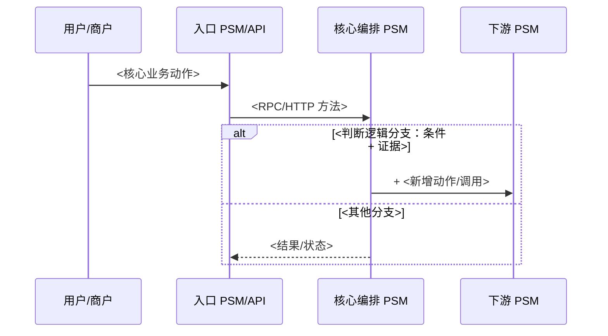

# PRD 时序图

## 目的

为技术方案的 `业务流程分析` 和 `业务流程系统时序分析` 生成 Mermaid 时序图。图中必须清晰表达 PRD 的业务动作和实现链路，便于评审人核对职责归属、分支逻辑和改动影响。

## 输入

- `prd2tech/<需求目录>/prd-understand.md` 中的结构化 PRD 摘要。
- `prd2tech/<需求目录>/prd-feature-split.md` 中的功能点矩阵。
- `prd2tech/<需求目录>/investigation.md` 中的 Wiki 和代码证据。
- 当前流程证据：API、handler、BP/XML action、配置、消息、表、下游调用。
- `prd-design-generate` 汇总的目标改动点图谱。

如果某个动作、参与方、分支条件或调用边很重要但缺少 PRD/Wiki/代码证据，标记 `待确认`，不得编造。

## 本地产物

- 输出必须写入 `prd2tech/<需求目录>/sequence-diagram.md`。
- 如果用户微调了 `prd-understand.md`、`prd-feature-split.md` 或 `investigation.md` 后重跑，必须基于最新本地文件重画时序图/流程图。
- 技术方案生成阶段直接读取 `sequence-diagram.md`，因此本文件中的图、差异表、证据说明必须可直接粘贴进方案正文。

## 工作流程

1. 按功能点确定绘图范围。触发条件、参与方或账户影响不同的流程，优先分开画。
2. 提取参与方：
   - 业务参与方：商户、用户、平台、服务商、机构、运营、风控、财务。
   - 系统参与方：入口服务、编排 PSM、下游 PSM、BP/XML action 引擎、DB、MQ、TCC/配置、外部机构。
3. 提取核心业务动作：
   - 尽量同时使用 PRD 动词和代码 action 名，例如 `提交退款申请 / RefundSettleInternalConsult`。
   - settle_center BP/XML 需要展示 action name 和 actionType，例如 `FUND_BALANCE_VERIFY`、`ALLOC_SUPPLY_SETTLE_FUND_GEN`、`*_FUND_DRIVEN`。
4. 提取分支：
   - 产品/配置条件、枚举分支、账户决策分支、金额校验、幂等/重试分支、同步/异步边界、成功/失败/补偿路径。
   - 使用 Mermaid `alt` / `else` / `opt` 表达条件，并标明证据。
5. 标注变更 diff：
   - 新增消息/节点前缀 `+`。
   - 修改调用/分支前缀 `~`。
   - 删除调用/分支前缀 `-`。
   - 如果在单图中标注 diff 会影响可读性，使用变更前/变更后两张图，并附差异表。
6. 校验一致性：
   - 图中每个参与方都必须能在正文或表格证据中找到。
   - 每个非平凡分支都要有 PRD、配置或代码证据。
   - 每个变更 action 都能映射回功能点和改动点表格行。

## 输出格式

写入 `prd2tech/<需求目录>/sequence-diagram.md`，内容应可直接粘贴进技术方案：

````markdown
#### <流程名称>时序图



| 变更类型 | 时序节点/动作 | 参与方 | 判断条件 | 证据 | 说明 |
| --- | --- | --- | --- | --- | --- |
| 新增/修改/删除/现状 |  |  |  | PRD/Wiki/代码/待确认 |  |
````

## 质量要求

- 不要把业务动作、系统调用和资金流混成一张无法区分语义的图。
- 已知 PSM/repo/API 时，不要画 `系统 A` 这类匿名框。
- 不要遗漏会影响资金、状态、幂等或下游副作用的判断分支。
- 涉及流程变更时，不要只给最终态图；必须包含 diff 标记或变更前/后对比。
