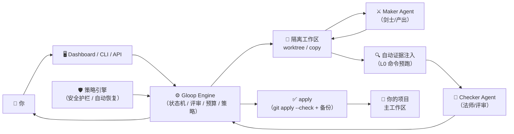

# Gloop

> Agent 转生成为冒险者，然后陷入循环。

中文 | [English](README.en.md)

**Gloop 是一个本机优先的 Loop Engineering 工作台。** 它把任意 ACP / CLI Agent 编排成带职业分工的冒险者小队，但真正主控循环的是平台：目标定义、拆解、执行、验收、返工和最终人工评审，都由 Gloop 显式管理。

**不让一个 Agent 自己解释目标、又自己宣布完成。**

---

## 快速开始

**推荐：无需安装，直接用 npx 运行（零配置，不需要 sudo）**

```bash
npm_config_registry=https://bnpm.byted.org npx @bytedance-dev/gloop start
```

首次运行会自动下载当前版本二进制到 `~/.gloop/bin/versions/v<version>/`，并在 `~/.gloop/bin/` 生成稳定入口；后续启动直接复用。

> npx 参数规则：`npx [npx参数] <包名> [传给程序的参数]`。所以 `--registry` 必须放在包名**前面**：
> ```bash
> npx --registry https://bnpm.byted.org @bytedance-dev/gloop start
> ```
> 推荐用环境变量方式（上面的写法），不会和 gloop 自身参数混淆。

启动后终端会提示把 `~/.gloop/bin/` 加到 PATH，之后就可以直接用 `gloop` 命令了。

**全局安装（可选）**

如果想全局安装：

```bash
npm i -g @bytedance-dev/gloop --registry https://bnpm.byted.org
gloop start
```

`gloop start` 默认后台运行 + 自动打开 Dashboard + 注册开机自启。分别用 `--no-detach` / `--no-open` / `--no-autostart` 关闭。

如果希望通过其他 agent 操作 Gloop，可安装 `gloop-operator` skill：

```bash
npm_config_registry=https://bnpm.byted.org npx agentbuddy@latest skill add skills.byted.org/default/public --skill gloop-operator --version 1.0.0
```

```bash
# 跑第一个 Quest
gloop run --query "在项目根目录创建 hello.txt"
gloop quest run --query "严格检查发布配置变更" --intensity adversarial
gloop quest diff <qid>
gloop quest review <qid> pass --comment "LGTM"
gloop quest apply <qid>
```

详细上手教程见 **[官方文档 · 5 分钟上手](https://bytedance.larkoffice.com/docx/T90HdWWBIoEMQCxAiSrcJ7Sqn2g#2-5-分钟上手)**。

---

## 它是什么

**Gloop 把 Coding Agent 的工作循环从模型上下文里拿出来，变成可观察、可恢复、可审计、可终审的平台状态机。**



### 支持的 Agent

Gloop 是通用 Agent 编排平台，不绑定任何特定 Agent。符合 ACP 协议的 Agent 可直接接入，未支持 ACP 的通过 CLI 适配。

| Agent | 接入方式 | 说明 |
|---|---|---|
| **TraeX** 🔥 剑士默认 | ACP / CLI | ACP 模式 `traex acp serve`；CLI 模式 `traex exec --ephemeral --json` |
| **Relay** 🔥 法师默认 | CLI | ByteDance Relay，CLI 事件流适配 |
| **Claude** | ACP | `npx --yes --package @agentclientprotocol/claude-agent-acp claude-agent-acp` |
| **Codex** | ACP | `npx @zed-industries/codex-acp` |
| **OMP** | ACP | `omp acp` |
| **Aiden X Claude** | CLI | `aiden x claude --stream-json --print` |
| **Aiden X Codex** | CLI | `aiden x codex --stream-json exec` |
| **Aiden** | CLI | 基础模式 `aiden --one-shot --stream-json` |
| **Pi** | CLI | Pi coding-agent |
| **Mock** | 内置 | 无真实 Agent 时的测试兜底 |
| 任意 ACP Agent | ACP | 符合 ACP 协议即可接入 |

### 核心概念

| 概念 | 说明 |
|---|---|
| **Quest** | 最小工作单元。分 `execute`（执行型）和 `design`（方案型） |
| **Adventurer** | 冒险者 = 角色 + 绑定的 Agent + prompt + 经验等级。分 Maker（产出）和 Checker（评审） |
| **Workspace** | 隔离工作区。支持 `worktree` / `copy` / `readonly` / `auto` |
| **Review** | 机器评审 + 策略自主闭环（HOTL）。checker pass 即最优解，自主 apply 写回主工作区；apply 失败或返工耗尽才转人工处理。评审带质量分；平台记录低分 pass 等风险信号，但不改写法师结论 |
| **Waiting Input** | 剑士可向用户提问，Quest 进入 `waiting_input` 状态，用户回答后自动恢复 |
| **Automation / Inbox** | 自动化触发 Quest，进入收件箱等你确认 |
| **Artifact** | Quest 的多模态附件输入（图片、文件），支持拖拽和粘贴上传 |
| **User Context** | 跨 Quest 持久化的全局背景知识，按需查询 |
| **Knowledge** | 将 User Context 导出为目录化 Markdown + YAML frontmatter 的可携带知识包（OKF 格式） |
| **Skill** | 注入到 Agent 系统 prompt 中的指令包，控制行为协议 |
| **Auto Evidence** | 法师评审前，平台自动运行 L0 纯读验证命令，注入可信证据链 |
| **Policy Engine** | 策略引擎：安全护栏、自动恢复、自动通过决策，全部可审计 |
| **Failure Attribution** | 结构化失败归因，标记 stage / category / recoverable 及建议操作 |

### 委托强度

强度是内部预算档，不是语义分类器；Gloop 不判断任务难度，只执行用户或 automation 显式选择。

| 强度 | 用户含义 | 预算行为 | 评审行为 |
|---|---|---|---|
| `quick` | 快速 | 10 turn / 1 次返工 / 30 分钟 quest | **跳过法师评审**，直接进 user_review |
| `standard` | 标准 | 跟随全局配置，默认 50 turn 安全网 / 3 次返工 / 3 小时 quest | 正常法师评审 |
| `deep` | 深入 | 80 turn / 4 次返工 / 8 小时 quest | 更长预算和更多返工空间 |
| `adversarial` | 严审 | 100 turn / 5 次返工 / 12 小时 quest | 法师应给出更强证据链 |

> **法师自治边界**：法师提交的 `pass` / `request_changes` / `reject` 是评审结论本身。平台不会因为低分 `pass` 自动改判，也不会因为返工进展慢自动升级强度；这类情况会记录为 `review.signal`，交给用户终审和 Dashboard 风险提示处理。

> **Quick 单阶段**：`quick` 强度只有剑士执行阶段，没有法师评审，快速交付后直接进入 user_review。适合简单、低风险任务。

### 法师验证命令与自动证据

法师通过 Bash 调用 `gloop ...` CLI 完成评审协议与验证动作；评审阶段会运行在可丢弃的 sandbox copy 中，`GLOOP_WORKSPACE_PATH` / `GLOOP_CONTEXT` 都指向 sandbox，不暴露真实工作区路径。阶段结束信号通过 `GLOOP_SIGNAL_WORKSPACE_PATH` 写回真实 Quest 工作区，因此 `gloop review ...` 能被 orchestrator 消费，而法师对普通文件的直接写入仍留在 sandbox。对工作区的直接写入会在阶段结束时被捕获为 `mage_sandbox_writes_captured` 并丢弃。

验证命令仍然只能通过 `mage_command_allowlist` 里的命令 ID 执行。Settings 页面可以扫描当前项目，基于 `go.mod`、`package.json`、`pyproject.toml`、`Cargo.toml` 等文件推荐测试、构建、lint、typecheck 命令；推荐项不会自动启用，必须人工加入白名单并保存配置。

命令可标记 `side_effect_level`：`L0` 纯读/分析、`L1` 本地可回滚变更、`L2` 外部副作用。L2 命令默认拒绝执行，只有 automation 显式开启 `allow_l2` 且未开启 `auto_apply` 时才允许。

**自动证据注入**：法师评审阶段开始前，平台会自动运行 L0 级别的快速验证命令（总预算 30s），把结果作为 `auto_collected_platform_evidence` 注入评审上下文。项目类型自动检测（Go/JS/Git），失败不影响流程。这让法师在评审一开始就能看到可信的基线证据。

### 第一性原则

- **平台主控循环**：Agent 只执行 phase；生命周期 / 验收 / 返工 / 终审全由 engine 管
- **生成者和验收者分离**：Maker 不能自己批准自己的产物
- **状态必须落盘**：关键进度可从 JSON/JSONL 恢复
- **人工评审是一等状态**：非平凡产物必须进入 user_review
- **预算就是停止条件**：turn、返工、时长、连续错误、无进展轮数都能阻断循环
- **策略可审计**：所有自动决策（恢复、自动通过、护栏）都走策略引擎，留下 decision_id 和输入哈希，可追溯可复盘
- **证据先于判断**：法师评审前平台自动采集 L0 证据，不让评审只靠产物自证

---

## 文档导航

| 文档 | 给谁看 | 在哪 |
|---|---|---|
| **📘 官方文档（主入口）** | 所有用户 | [飞书文档](https://bytedance.larkoffice.com/docx/T90HdWWBIoEMQCxAiSrcJ7Sqn2g) |
| **📋 官方文档 Markdown 镜像** | 离线查阅 | [`gloop-official-doc.md`](gloop-official-doc.md) |
| **🏗 架构说明** | 内核开发者 / 贡献者 | [`ARCHITECTURE.md`](ARCHITECTURE.md) |
| **🗺 产品路线图** | 想了解未来方向 | 官方文档「附录 A：路线图」及 `PRDv2.md` |

---

## 从源码运行

```bash
go test ./...
go run ./cmd/gloop doctor agents --json
go run ./cmd/gloop doctor e2e --json
go run ./cmd/gloop start --no-detach --no-autostart --no-open --port 37317
```

本地开发建议隔离数据目录：`export GLOOP_DATA_DIR="$PWD/.gloop-dev"`

`doctor agents` 检查本机 Agent 配置、可执行文件、版本和适配器状态；加 `--smoke` 会对支持的 CLI Agent 跑最小非交互调用。`doctor e2e` 使用 Mock executor 跑一条本地闭环，覆盖状态机、工作区、用户终审、diff 和 apply；加 `--agent <name>` 可使用真实 agent 跑 E2E 合约验证。Mock 只用于测试和调试，不会被选择为可接委托的冒险者 Agent。

---

## Dashboard

React + Vite 构建，通过 `go:embed` 打进二进制，无需单独部署前端。支持 URL 路由（刷新不丢状态、浏览器前进/后退正常工作）。

委托详情页现在以统一 Execution Trace 展示完整执行过程：语义事件、Agent 消息、用户评论、平台观察到的工具调用，以及每轮实际注入给 Agent 的 ContextPack。ContextPack 会展示 `kind`、block 列表、source/trust、截断状态和渲染后的原文，方便判断 Agent 当时到底看到了什么。

| 页面 | 功能 |
|---|---|
| 委托看板 | 看板 / 列表视图，分组、排序、筛选 |
| 委托详情 | Execution Trace、ContextPack、阶段时间线、inline diff、评审对话、blocked / waiting_input 处理、artifact 附件 |
| Inbox | 处理自动化创建的待确认委托（accept / reject + 拒绝理由） |
| Adventurers | 冒险者管理、Activity Summary（状态 + 成功率趋势 + 最近失败） |
| Automations | 自动化规则：手动触发、定时调度、自动启动 |
| Skills | 内置技能查看与管理 |
| Knowledge | 知识包浏览、diff 对比、导出 |
| Stats | 个人统计、异常信号下钻 |
| Settings | 全局配置、Agent 管理、工作区设置、命令白名单 |

---

## CLI 命令速查

| 命令 | 说明 |
|---|---|
| `gloop start` | 启动服务（后台 + 开 Dashboard + 注册开机自启） |
| `gloop stop / restart / status` | 停止 / 重启 / 查看服务状态 |
| `gloop logs [-f] [-n N]` | 查看服务日志 |
| `gloop dashboard [--print]` | 打开或打印 Dashboard URL |
| `gloop quest run --query "..."` | 创建并执行 Quest |
| `gloop quest info / list / show` | 查看当前或指定 Quest、列出和展示详情 |
| `gloop quest diff / review / apply / discard / cancel` | Quest 生命周期管理 |
| `gloop quest comment / answer` | 追加用户评论、回答 waiting_input 问题 |
| `gloop quest backup list / backup show` | 查看 apply 前备份 |
| `gloop quest resolve-blocked / spawn-execute / spawn / cleanup` | 阻塞恢复、方案派生执行、扇出子委托、工作区清理 |
| `gloop design --query "..."` | 创建方案型 Quest |
| `gloop adventurer list / show` | 列出/查看冒险者 |
| `gloop automation list / templates / run / edit / enable / disable / show` | 自动化管理 |
| `gloop inbox list / edit / accept / reject` | 收件箱处理 |
| `gloop context list / show / summary / refresh / export / write-dim / write-summary` | 用户上下文查询、刷新、写入与知识导出 |
| `gloop command list / run` | Mage 白名单命令管理 |
| `gloop skill list [--kind capability|orchestration] [--category ...] / show / validate` | 内置技能查看和校验，支持按种类/分类筛选 |
| `gloop code search` | 代码搜索工具 |
| `gloop prompt list / show` | Prompt 模板查看 |
| `gloop notify` | 发送飞书通知 |
| `gloop stats [--range week]` | 个人统计 |
| `gloop config show / edit` | 配置管理 |
| `gloop update [--check] [--version X]` | 检查/升级 gloop 版本，自动重启 daemon |
| `gloop doctor agents [--smoke] / notifications / e2e [--agent X]` | Agent、通知与 E2E 基准诊断 |
| `gloop idl export` | 导出 IDL 定义 |
| `gloop init` | 初始化数据目录和基础冒险者 |

---

## 内置 Skill

Gloop 官方内置 9 个 skill，全部以 `gloop-` 前缀命名，按 **kind**（大类）分为两类：

- **`capability`（能力型）**：提供具体能力工具或方法论，不直接驱动循环状态
- **`orchestration`（编排型）**：直接参与 Quest 生命周期，驱动阶段推进或评审

每个 skill 遵循统一的 **CLI Contract** 格式（命令一览 / 详细说明 / 通用约定），并在元数据中声明 `related_skills`（结构化引用关系：`depends_on` / `related` / `see_also`），便于技能间的发现与联动。

`gloop skill list` 支持 `--kind` 和 `--category` 筛选，快速定位目标技能。

| Skill | Kind | 作用 | 注入给 |
|---|---|---|---|
| `gloop-quest-execution` | orchestration | 剑士执行协议：`gloop phase done/fail` 时机、产出规范 | Warrior |
| `gloop-quest-review` | orchestration | 法师评审协议：`gloop review pass/request-changes/reject` 时机、证据链要求 | Mage |
| `gloop-quest-fanout` | orchestration | 委托扇出：大任务拆分为多个并行子委托 | Warrior |
| `gloop-self-awareness` | capability | 任务上下文自查：quest_info 使用规范 | 双职业 |
| `gloop-note-keeping` | capability | 跨阶段笔记系统：note_add 用法 | 双职业 |
| `gloop-user-context` | capability | 全局工作上下文查询：context_query 用法 | 双职业 |
| `gloop-user-notification` | capability | 用户通知：重要节点主动推送飞书消息 | 双职业 |
| `gloop-code-exploration` | capability | 代码探索方法论：分层代码理解模型 | 双职业 |
| `gloop-inbox-triage` | capability | 收件箱智能分类：按优先级整理待处理委托 | 双职业 |

---

## 安全边界

Gloop 是本机平台，不是远程沙箱。安全边界来自：
- 工作区隔离（worktree / copy）
- apply 前 `git apply --check` 预检 + 备份快照 + 多种 apply 策略（patch / patch_then_merge / merge）
- 主工作区 dirty 检查
- Checker 运行在可丢弃 sandbox copy 中；内部 Bash / Edit / Write / Task 等能力只看到 sandbox，真实工作区不暴露给法师进程
- Mage 白名单验证命令（`side_effect_level` L0/L1/L2 三级管控）
- 自动证据注入仅跑 L0 纯读命令，30s 总预算，失败不影响流程
- 策略引擎硬护栏（workspace diff / L2 权限 / 外部副作用 必须人工评审）
- `.gloopignore` 敏感文件排除
- 本地绑定 Token 鉴权
- Agent 故障自动恢复（认证过期等可恢复错误自动重试，受策略管控）
- 用户终审超时自动处理（可配置超时动作）

---

## 项目结构

```text
cmd/                    进程入口
internal/
  model/                稳定词汇表与原语值（0 import 规则）
  domain/quest/         领域层：Quest 聚合、状态机、Phase 定义、Pipeline
  fsstore/              文件系统持久化 + workspace + git + 命令白名单 + 统计
  orchestrator/         状态机 + 循环引擎 + 失败归因 + Agent 恢复 + 自动证据（核心）
  executor/             ACP / CLI / Mock Agent 适配（ISP 接口拆分）
  platformtools/        平台机制处理器（供 CLI/API/测试复用，不作为 Agent native tool 暴露）
  policy/               策略引擎：安全护栏 / 自动恢复 / 自动通过
  server/               HTTP API + SSE + Dashboard 内嵌
  cli/                  命令解析与全部子命令
  events/               进程内事件总线
  prompt/               Prompt 模板渲染
  skills/               Skill 注册表 + 加载
  auth/                 本地 Token 鉴权
  acp/                  ACP 客户端 SDK
  notifications/        通知系统（飞书等）+ 事件订阅
  idl/                  IDL 导出
  arch/                 依赖方向架构测试
  version/              版本信息
  updatecheck/          版本更新检查
skills/                 官方内置 skill 资产（go:embed）
web/                    React + Vite Dashboard
```

依赖方向（arch 测试强制）：
```text
cmd -> cli/server -> orchestrator -> domain/fsstore/executor/events/policy/prompt -> model
```
