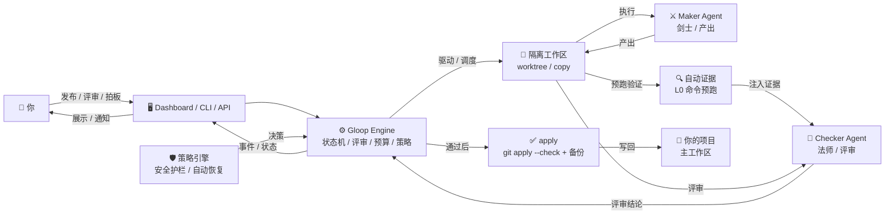
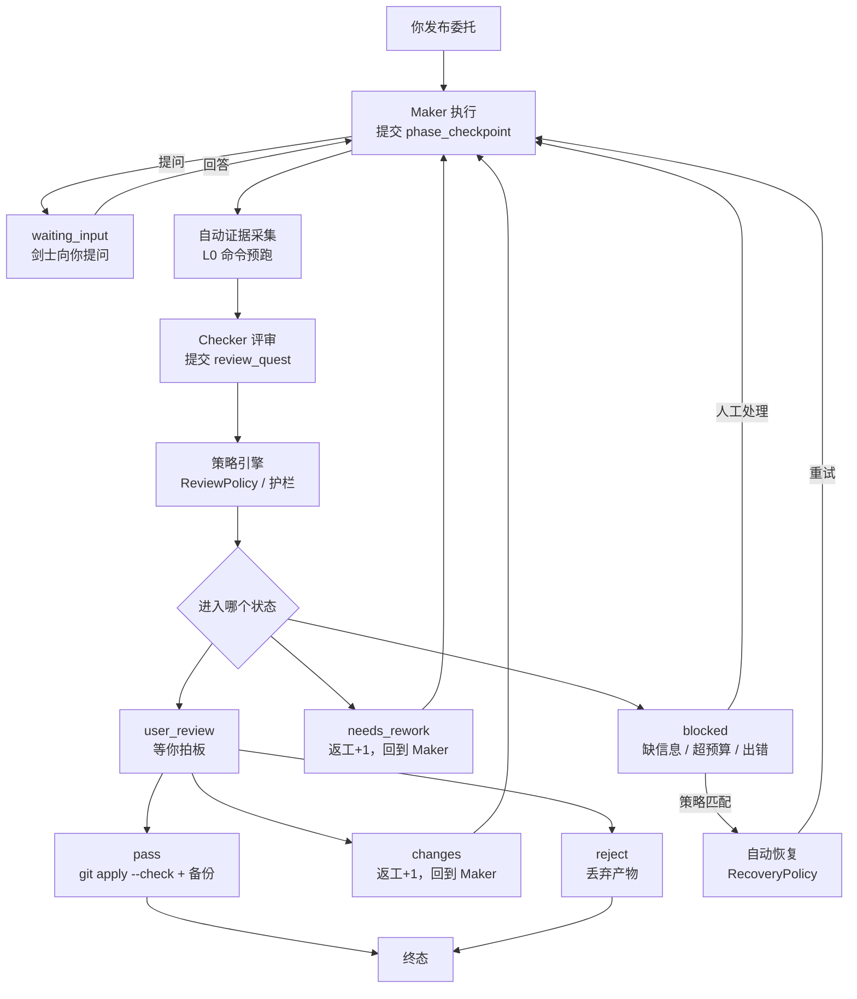
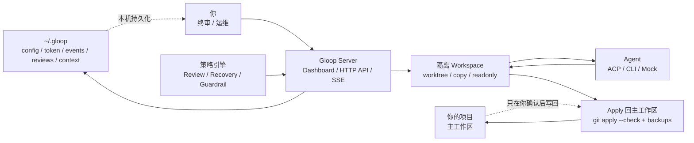

# Gloop 官方文档 — 本机优先的 Loop Engineering 工作台

<callout emoji="✅">
**Slogan：** Agent 转生成为冒险者，然后陷入循环。

**定位：** Gloop 是一个本地部署的 Loop Engineering 工作台。它把任意 ACP / CLI Agent 编排成带职业分工的冒险者小队，但真正主控循环的是平台：目标定义、拆解、执行、验收、返工和最终人工评审都由 Gloop 显式管理。

**本文档是唯一官方文档。** 产品定位、使用指南、API 参考、Agent 接入、安全边界和能力范围都以本文档为准。
</callout>

<callout emoji="📌">
**不用全读。** 本文档分两部分：
- **上篇 · 用户指南**（第 1-6 章）：从零到一学会用 Gloop，顺着读下来就行
- **下篇 · 参考资料**（第 7-12 章 + 附录）：用到再查，不用记
</callout>

| 项目 | 说明 |
|-|-|
| Slogan | Agent 转生成为冒险者，然后陷入循环 |
| 产品形态 | 单机单用户，本地运行，本地持久化，Go 单文件二进制 + 内置 React Dashboard |
| 核心原则 | 系统做机制，Agent 做决策；做的人不评，评的人不做；人类终审是一等状态 |
| 默认数据目录 | `~/.gloop` |
| 默认端口 | `37317`，端口占用时可用 `--port 0` 从 37317 起扫描可用端口 |
| 推荐入口 | `npm i -g @bytedance-dev/gloop --registry https://bnpm.byted.org` 后运行 `gloop start` |
| 文档版本 | v2.4，更新时间：2026-06-23 |

---

# 上篇 · 用户指南

## 1. Gloop 是什么

### 一句话

**Gloop 把 Coding Agent 的工作循环从模型上下文里拿出来，变成可观察、可恢复、可审计、可终审的平台状态机。**

不让一个 Agent 自己解释目标、又自己宣布完成。

### 它解决什么问题

当你把一个编码任务丢给 Agent，通常会遇到：
- 产出质量不稳定，不知道它什么时候算"做完了"
- 改了什么藏在上下文中，review 要翻几千行对话
- 出了错没法复现，因为状态全在模型记忆里
- 想返工又得重新说一遍背景

Gloop 的做法是把循环拿出来管：目标明确写下来、执行过程逐条落盘、评审和产出分离、最终裁决权在你手里。

### 整体架构



### 一个类比

可以把 Gloop 想成本机上的**冒险家公会**：
- 你把工作发布成**委托（Quest）**
- 公会派**冒险者（Adventurer）**去做
- **剑士（Maker）**负责干活产出
- **法师（Checker）**负责验收评审
- 公会负责登记、留痕、派单和终审入口

这只是帮助理解的比喻。下面统一用工程术语。

### 第一性原则

| 原则 | 含义 |
|-|-|
| 平台主控循环 | Agent 只执行阶段任务；生命周期、验收、返工、终审由 engine 管 |
| 生成者和验收者分离 | Maker 负责产出，Checker 负责评审，不能自己批准自己 |
| 状态必须落盘 | 关键进度可从 JSON / JSONL 恢复，不只存在模型上下文里 |
| 人工评审是一等状态 | 非平凡产物必须进入 user_review 阶段等你拍板 |
| 预算就是停止条件 | turn、返工、时长、连续错误、连续无进展都能阻断无限循环 |
| 策略可审计 | 所有自动决策（恢复、自动通过、护栏）都走策略引擎，留下 decision_id 和输入哈希 |
| 证据先于判断 | 法师评审前平台自动采集 L0 证据，不让评审只靠产物自证 |

### 不做什么

| 不做什么 | 原因 |
|-|-|
| 多用户 / 多租户权限系统 | Gloop 聚焦本机单用户工作台 |
| 代码托管 / Git server | 项目仍在你文件系统里，Gloop 只管理工作循环 |
| 平台替 Agent 做语义判断 | 系统做机制，Agent 做决策 |
| 管理 Agent 内部记忆或插件生态 | Agent 自己的工具和内部状态由 Agent harness 负责 |

---

## 2. 5 分钟上手

<callout emoji="✅">
推荐用 npm 安装预编译二进制。Gloop 本体是 Go 单文件，Node 只用于安装阶段下载对应平台二进制；运行时不依赖 Node。
</callout>

### 准备

- Node `>=18`（仅用于 npm 安装）
- 没有真实 Agent 也能启动，内置 Mock 兜底

<callout emoji="📋">
**支持的 Agent 一览**

| Agent | 接入方式 | 说明 |
|-|-|-|
| **TraeX** 🔥 剑士默认 | ACP / CLI | ACP 模式 `traex acp serve`；CLI 模式 `traex exec --ephemeral --json` |
| **Relay** 🔥 法师默认 | CLI | ByteDance Relay，CLI 事件流适配 |
| **Claude** | ACP | `npx --yes --package @agentclientprotocol/claude-agent-acp claude-agent-acp` |
| **Codex** | ACP | `npx @zed-industries/codex-acp` |
| **OMP** | ACP | `omp acp` |
| **Aiden X Claude** | CLI | `aiden x claude --stream-json --print` |
| **Aiden X Codex** | CLI | `aiden x codex --stream-json exec` |
| **Aiden** | CLI | 基础模式 `aiden --one-shot --stream-json` |
| **Pi** | CLI | Pi coding-agent |
| 任意 ACP Agent | ACP | 符合 ACP 协议即可接入 |
| **Mock** | 内置 | 测试/链路验证用，不需要外部 Agent |
已有其中一个在 `PATH` 里就能直接用。配置方式见第 9 章。
</callout>

### 第一步：安装并启动

```bash
npm i -g @bytedance-dev/gloop --registry https://bnpm.byted.org
gloop start
```

如果希望通过其他 agent 操作 Gloop，可安装 `gloop-operator` skill：

```bash
npm_config_registry=https://bnpm.byted.org npx agentbuddy@latest skill add skills.byted.org/default/public --skill gloop-operator --version 1.0.0
```

`gloop start` 默认做三件事：

| 默认行为 | 说明 | 关闭方式 |
|-|-|-|
| 后台运行 | 脱离终端，日志写入 `~/.gloop/server.log` | `--no-detach` / `-nd` |
| 自动打开浏览器 | 等 `/healthz` 通过后打开 Dashboard | `--no-open` / `-no` |
| 注册开机自启 | 用户级，不需要 sudo | `--no-autostart` / `-na` |

启动后你会看到：

```text
Gloop 已在后台启动
Listen:      http://0.0.0.0:37317
Data Dir:    /home/you/.gloop
Dashboard:   http://10.x.x.x:37317/dashboard?t=<24字节绑定密钥>
Log:         /home/you/.gloop/server.log
Pid:         1733333
```

<callout emoji="💡">
Dashboard URL 里的 `?t=` 是本地绑定密钥，防止同机器其他进程误读写 `~/.gloop`。截图、转发或贴日志时记得打码。
</callout>

### 第二步：跑一个完整的 Quest

用 Mock Agent 跑通完整闭环，确认链路正常：

```bash
# 1. 确认服务正常
gloop status

# 2. 创建一条执行型委托
gloop run --query "在项目根目录创建一个 hello.txt，内容为 Hello, Gloop!"

# 3. 查看状态（等它进入 user_review）
gloop quest list

# 4. 看看它改了什么
gloop quest diff <qid>

# 5. 通过评审
gloop quest review <qid> pass --comment "LGTM"

# 6. 应用到你的主工作区
gloop quest apply <qid>
```

恭喜，第一个 Quest 完成了。

### 日常运维命令

```bash
gloop status      # 查看服务状态
gloop dashboard   # 打开 Dashboard
gloop logs -n 50  # 最近 50 行日志
gloop logs -f     # 实时跟踪日志
gloop doctor agents --json        # 检查 Agent 配置、二进制、版本和适配器
gloop doctor agents --smoke --json
                                  # 对支持的 CLI Agent 跑最小非交互调用
gloop doctor notifications --json # 检查通知配置和发送链路
gloop doctor e2e --json           # 跑本地 Mock E2E，验证状态机/workspace/review/apply
gloop restart     # 重启（改配置或 Agent 后）
gloop stop        # 停止服务
```

<callout emoji="💡">
什么时候需要 restart？改了 `~/.gloop/config.json`、`~/.gloop/agents/` 下的配置，或升级了二进制。冒险者、prompts、automation、skills、quest 本身都不需要 restart。
</callout>

### 从源码运行

```bash
go test ./...
go run ./cmd/gloop doctor agents --json
go run ./cmd/gloop doctor e2e --json
go run ./cmd/gloop start --port 37317
```

本地开发建议隔离数据目录：

```bash
export GLOOP_DATA_DIR="$PWD/.gloop-dev"
go run ./cmd/gloop start \
  --no-detach --no-autostart --no-open \
  --host 0.0.0.0 --port 37317 --data-dir "$GLOOP_DATA_DIR"
```

---

## 3. 核心概念

这一页帮你建立术语体系，后面的章节都会用到。

### Quest（委托）

Gloop 的最小工作单元。你发布一条委托，Gloop 为它创建隔离工作区、选择执行者、驱动执行与评审，最终等你裁决。

| 类型 | 说明 | 典型产出 |
|-|-|-|
| `execute` | 执行型，直接动手 | 代码、文档、配置、补丁 |
| `design` | 方案型，先产出方案再评审 | 设计方案、迁移计划、风险分析；通过后可 spawn 出 execute Quest |

### Quest Intensity（委托强度）

强度是内部预算档，不是语义分类器。Gloop 本身不判断任务难度，只执行用户或 Automation 显式选择。

| 强度 | 用户含义 | 预算行为 | 评审行为 |
|-|-|-|-|
| `quick` | 快速 | 10 turn / 1 次返工 / 30 分钟 Quest | **跳过法师评审**，直接进 user_review |
| `standard` | 标准 | 跟随全局配置，默认 50 turn 安全网 / 3 次返工 / 3 小时 Quest | 正常法师评审 |
| `deep` | 深入 | 80 turn / 4 次返工 / 8 小时 Quest | 更长预算和更多返工空间 |
| `adversarial` | 严审 | 100 turn / 5 次返工 / 12 小时 Quest，法师需要更强证据链 | 法师应给出更强证据链 |

<callout emoji="💡">
**法师自治边界**：法师提交的 `pass` / `request_changes` / `reject` 是评审结论本身。平台不会因为低分 `pass` 自动改判，也不会因为返工进展慢自动升级强度；这类情况会记录为 `review.signal`，交给用户终审和 Dashboard 风险提示处理。

**Quick 单阶段交付**：`quick` 强度只有剑士执行阶段，没有法师评审，快速交付后直接进入 user_review。适合简单、低风险、你肉眼就能判断的任务。
</callout>

### Adventurer（冒险者）

冒险者 = 角色 + 名字 + 绑定的 Agent + 自定义 prompt + 经验等级 + 历史战绩。

| 职业 | 工程角色 | 做什么 | 权限边界 |
|-|-|-|-|
| Warrior / 剑士 | Maker | 理解任务、读写代码、执行改动、提交阶段产物 | 读 / 写 / 执行 / 搜索，受工作区和 Agent 限制 |
| Mage / 法师 | Checker | 评审产物、运行白名单验证命令、给出评审结论；严审时要说明 evidence / failure_modes / confidence / residual_risks | 文件只读 + 只读 native tools + 平台白名单命令 |

<callout emoji="💡">
**经验等级系统**：每位冒险者有 Level、Exp、WinCount、LoseCount。完成 Quest 获得经验，胜利/失败影响胜率。平台按「胜率优先、等级次之、经验再次之、先创建者优先」的规则挑选冒险者。等级提升会获得称号（如「大剑士」「大法师」）。
</callout>

### Workspace（隔离工作区）

每个 Quest 都在独立工作区里运行。Agent 不直接碰你的主工作区，最终要不要 apply 由你决定。

| 模式 | 说明 | 适用场景 |
|-|-|-|
| `worktree` | Git worktree 原生隔离 | Git 项目 + 写操作，默认推荐 |
| `copy` | 完整目录拷贝 | 非 Git 项目 + 写操作 |
| `readonly` | 直接引用源目录，只读约定 | 查询、分析、调研 |
| `auto` | Git 项目用 worktree，否则 copy | 默认模式 |

### Artifact（多模态附件）

Quest 支持附加多模态输入（图片、文件等），可通过拖拽或粘贴上传。Artifact 会传递给执行 Agent 作为任务上下文的一部分。

### Review（评审与终审）

Checker（Mage）负责机器侧评审，你负责最终裁决。可以通过、要求返工或拒绝。通过后仍需显式 apply 才会写回主工作区。

评审带 1–10 分质量分。低分 pass、返工进展慢等情况会作为可审计风险信号记录，平台不改写法师结论。

### Waiting Input（等待用户输入）

剑士在执行过程中如果遇到信息不足、需求模糊或需要用户确认的决策点，可以显式向用户提问。此时 Quest 进入 `waiting_input` 状态并暂停执行，等你回答后自动恢复。超时未回答可配置为自动继续、转终审或阻塞。

这比让 Agent 自己猜答案更可靠，也比 blocked 状态更轻量——它是正常工作流的一部分，不是异常。

### Automation & Inbox

Automation 定义自动委托：什么时候触发、创建什么 Quest、给谁执行、使用什么强度、是否自动开始。自动化创建的 Quest 进入 Inbox（收件箱），你可以 accept、reject 或编辑。

### Skills

分发给 Agent 的指令包。平台只负责索引、分发和元数据解析，不解释 skill 语义。

官方内置 9 个 skill，全部以 `gloop-` 前缀命名，按 **kind** 分为两大类：

| 类别 | 含义 | 典型技能 |
|-|-|-|
| `capability`（能力型） | 提供具体工具能力或方法论，不直接驱动循环状态 | self-awareness、note-keeping、user-context、user-notification、code-exploration、inbox-triage |
| `orchestration`（编排型） | 直接参与 Quest 生命周期，驱动阶段推进或评审 | quest-execution、quest-review、quest-fanout |

每个 skill 遵循统一的 **CLI Contract** 文档结构：
- **命令一览**：该 skill 涉及的全部命令及其作用
- **详细说明**：每条命令的用法、参数、返回格式、注意事项
- **通用约定**：跨命令的行为准则、错误处理、边界说明

技能元数据中声明 `related_skills` 字段，用结构化方式描述技能间的引用关系（`depends_on` / `related` / `see_also`），支持技能发现与联动。

`gloop skill list` 支持 `--kind` 和 `--category` 标志快速筛选。

| 内置 Skill | Kind | 给谁用 | 做什么 |
|-|-|-|-|
| `gloop-quest-execution` | orchestration | Maker | 执行阶段协议：phase_checkpoint / phase done 等 |
| `gloop-quest-review` | orchestration | Checker | 评审阶段协议：review pass / request-changes / reject 等 |
| `gloop-quest-fanout` | orchestration | Maker | 委托扇出：大任务拆分为多个并行子委托 |
| `gloop-self-awareness` | capability | 通用 | 查询 Quest、Phase、History 等平台事实 |
| `gloop-note-keeping` | capability | 通用 | 追加决策、风险、TODO 等跨阶段笔记 |
| `gloop-user-context` | capability | 通用 | 查询全局工作上下文（跨 Quest 背景知识） |
| `gloop-user-notification` | capability | 通用 | 重要节点主动推送飞书通知给用户 |
| `gloop-code-exploration` | capability | 通用 | 分层代码理解方法论，减少重复扫代码 |
| `gloop-inbox-triage` | capability | 通用 | 收件箱智能分类：按优先级整理待处理委托 |

### User Context

跨 Quest 持久化的全局背景知识。以摘要形式存在 `~/.gloop/context`，Agent 按需查询，不是每轮都塞全量。

| 维度 | 来源 |
|-|-|
| `workspace` | 本地 Git 仓库 + 项目文件 |
| `lark_im` | 飞书群聊 |
| `lark_doc` | 飞书文档 |
| `lark_calendar` | 飞书日历 |
| `gloop_history` | Gloop 历史委托 |

### 自动证据注入（Auto Evidence）

法师评审阶段开始前，平台会**自动**运行 L0 级别的纯读验证命令，把结果作为 `auto_collected_platform_evidence` 注入评审上下文。这不是让法师少干活，而是给它一份可信的基线证据，不让评审只靠产物自证。

**设计原则：**
- 只跑 L0 纯读命令，无副作用
- 总耗时 < 30s，超时跳过
- 项目类型自动检测（Go / JS / Git）
- 失败不影响流程，打日志跳过
- 结果标注 `auto_collected`，与 Agent 主动调用区分

目前自动跑的命令：Git diff stat / diff name-only；Go 项目加 go-build / go-vet / go-mod-verify；JS 项目加 npm-build-check / npm-audit。

### 策略引擎（Policy Engine）

所有"自动做什么"的决策都走策略引擎，不写死在业务代码里。每个决策带 `decision_id`、`input_hash`、`policy_name` 和 `conditions`，可追溯可复盘。

**内置策略：**

| 策略 | 作用 |
|-|-|
| `ReviewPolicy` | 评审结果裁决：哪些可以自动通过，哪些必须人工评审 |
| `RecoveryPolicy` | 阻塞恢复：哪些失败可以自动重试，哪些必须人工介入 |
| `HardGuardrail` | 安全护栏：workspace diff / L2 权限 / 外部副作用 一律要求人工评审 |

**自动通过白名单**：allowlisted 的 automation + no workspace diff + context_store 类效果，可自动通过，不需要人工点。其余全部 require_user——安全优先。

**自动恢复规则**：连续 Agent 错误、无进展等可恢复错误，自动重试一次（+5 turn / +15 min），超过恢复次数上限转人工。

---

## 4. 它是怎么工作的

Gloop 的循环分两层：Quest 级宏循环管生命周期，Turn 级微循环管与 Agent 的 Think/Act/Observe 交互。所有自动决策走策略引擎，留下可审计决策链。

### 大循环



文字版：

```text
你发布 Quest
  → Maker 执行任务（可向你提问 → waiting_input → 回答后继续）
  → 完成后显式提交 phase_checkpoint
  → 平台自动采集 L0 证据（Auto Evidence）
  → Checker 评审产物，显式调用 review_quest（带质量分）
  → 策略引擎 + Acceptance Checker 做协议/状态/安全判定
  → 三种可能：blocked / needs_rework / user_review
      · blocked：RecoveryPolicy 尝试自动恢复（+turn / +时长），失败则等人工处理
      · needs_rework：质量分低于阈值或评审要求返工，回到 Maker
  → 你终审：pass / changes / reject
       pass    → 可 apply 到主工作区
       changes → 回到 Maker，返工计数 +1
       reject  → 丢弃产物，进入终态
```

### 停止条件

不用担心无限循环。这些参数都会让循环停下来：

| 配置项 | 作用 | 默认值 |
|-|-|-|
| `max_turns_per_phase` | 单阶段最多跑多少轮（技术安全网，不作为主预算） | 50 |
| `max_rework_per_quest` | 最多返工几次 | 3 |
| `max_duration_per_phase_ms` | 单阶段时长上限 | 30 分钟 |
| `max_duration_per_quest_ms` | 总时长上限 | 3 小时 |
| `max_consecutive_agent_errors` | 连续错多少次就阻塞 | 2 |
| `max_no_progress_turns` | 连续多少轮没进展就阻塞 | 3 |
| `user_confirm_timeout_ms` | 等待用户终审超时 | 72 小时 |
| `max_review_hints` | 法师忘调 review 时补提示次数 | 2 |
| `max_execution_hints` | 剑士忘调 phase_checkpoint 时补提示次数 | 2 |

主预算由 guardrails（时长/无进展/连续错误）决定，`max_turns_per_phase=50` 只是技术安全网。`quick` / `deep` / `adversarial` 会在单个 Quest 上写入预算覆盖，`standard` 跟随全局配置。

法师验证命令必须来自 `mage_command_allowlist`。Settings 可以扫描项目文件（如 `go.mod`、`package.json`、`pyproject.toml`、`Cargo.toml`）并推荐测试、构建、lint、typecheck 命令；推荐项不会自动启用，必须由用户加入白名单并保存配置。

命令可声明 `side_effect_level`：`L0` 纯读/分析、`L1` 本地可回滚变更、`L2` 外部副作用。L2 命令默认拒绝执行，只有 Automation 显式开启 `allow_l2` 且关闭 `auto_apply` 时才允许。

<callout emoji="💡">
Gloop 不做语义质量裁决，不用关键词替代判断，不藏一个 AI 当最终裁判。它只做确定性判断：环境对不对、协议完不完整、安全策略过没过、预算超没超。
</callout>

---

## 5. 常见工作流

### 工作流 1：创建一条执行型委托

最简方式：

```bash
gloop run --query "给项目加一份贡献指南"
```

完整参数：

```bash
gloop quest run \
  --query "把 README 翻译成英文" \
  --type execute \
  --intensity standard \
  --working-dir /path/to/repo
```

也可以在 Dashboard 委托看板上点"新建委托"，选择快速 / 标准 / 深入 / 严审。

### 工作流 2：评审并应用

Quest 执行完会进入 `user_review` 状态：

```bash
# 看改了什么
gloop quest diff <qid>

# 三种选择
gloop quest review <qid> pass --comment "LGTM"        # 通过
gloop quest review <qid> changes --comment "补测试"    # 要求返工
gloop quest review <qid> reject --comment "方向不对"   # 拒绝

# 通过后，应用到主工作区
gloop quest apply <qid>
```

apply 前会自动用 `git apply --check` 预检冲突，并创建备份快照。如果你的主工作区有未提交改动，会拒绝 apply — 防止覆盖你的工作。

### 工作流 3：处理卡住的委托

当 Quest 缺信息、超预算或出错时，会进入 `blocked` 状态：

```bash
# 看为什么卡住
gloop quest show <qid>

# 三种处理方式
gloop quest resolve-blocked <qid> --action continue     # 追加预算，继续干
gloop quest resolve-blocked <qid> --action user-review  # 转我来终审
gloop quest resolve-blocked <qid> --action cancel        # 取消得了
```

<callout emoji="💡">
**自动恢复**：连续 Agent 错误、无进展等可恢复错误，平台会通过 RecoveryPolicy 自动重试一次（+5 turn / +15 min），不需要你手动处理。只有自动恢复也有次数上限，超过就转 blocked 等你。
</callout>

### 工作流 3.5：剑士向你提问（waiting_input）

剑士执行中遇到信息不足或需要确认时，会主动提问。Quest 进入 `waiting_input` 状态：

```bash
# 在 Dashboard 或 CLI 回答问题
gloop quest answer <qid> --question-id <qid> --answer "是的，就用这个方案"

# 也可以让它自己决定
gloop quest answer <qid> --question-id <qid> --answer "你自己判断，按最佳实践来"
```

超时未回答可配置超时动作：继续 / 转终审 / 阻塞。

### 工作流 4：设置自动化委托

Automation 可以定时或按条件自动创建 Quest：

```bash
# 看看有哪些
gloop automation list
gloop automation templates

# 手动跑一个
gloop automation run <id> --watch
```

自动化创建的 Quest 会进 Inbox 等你确认：

```bash
gloop inbox list
gloop inbox accept <qid>
gloop inbox reject <qid>
```

### 工作流 5：接入新的 Agent

Agent 配置放在 `~/.gloop/agents/`，每个 Agent 一个 JSON 文件。也可以在 Dashboard 的 Settings 页面管理。

改完 `gloop restart` 生效。

---

## 6. Dashboard 一览

Dashboard 由 React + Vite 构建，产物通过 `go:embed` 打进 Go 二进制。你不需要单独部署前端。支持 URL 路由——刷新不丢状态，浏览器前进/后退正常工作。

委托详情页使用统一 Execution Trace，把语义事件、Agent 消息、用户评论、平台观察到的工具调用、ContextPack 注入记录放在同一条时间线上。ContextPack 展示 `kind`、block 列表、source/trust、截断状态和渲染原文，用来回答一个关键问题：Agent 当时到底看到了什么。

| 页面 | 做什么 |
|-|-|
| 委托看板 | 看板 / 列表视图，分组、排序、筛选 |
| 委托详情 | Execution Trace、ContextPack、阶段时间线、inline diff、评审对话、blocked / waiting_input 处理、artifact 附件 |
| Inbox | 处理 Automation 创建的待确认委托（accept / reject + 拒绝理由） |
| Adventurers | 冒险者管理、Activity Summary（当前状态 + 成功率趋势 + 最近失败） |
| Automations | 自动化规则：手动触发、定时调度、自动启动 |
| Skills | 查看内置和自定义技能 |
| Knowledge | 知识包浏览、diff 对比、导出 |
| Stats | 个人统计、异常信号下钻 |
| Settings | 全局配置、Agent 管理、工作区设置、命令白名单 |

<callout emoji="💡">
改了 `web/src` 必须 `cd web && npm run build` 并提交 `web/dist`。否则用户运行二进制看到的还是旧 Dashboard。
</callout>

---

# 下篇 · 参考资料

以下章节按需查阅，不用记。

## 7. CLI 参考

### 7.1 服务与运维

```bash
gloop start [--host 0.0.0.0] [--external-host 10.x.x.x] [--port 37317]
gloop stop [--wait]
gloop restart
gloop status
gloop dashboard
gloop dashboard --print
gloop logs -n 50
gloop logs -f
```

### 7.2 Quest 操作

```bash
# 创建
gloop run --query "给项目加一份贡献指南"
gloop design --query "重构 agent 适配层"
gloop quest run --query "把 README 翻译成英文" --type execute
gloop quest run --query "严格检查发布配置变更" --intensity adversarial

# 查询
gloop quest info <qid>
gloop quest list
gloop quest show <qid> --events 20
gloop quest diff <qid> --full
gloop quest backup list <qid>
gloop quest backup show <qid> <backup_id>

# 回答问题（waiting_input）
gloop quest answer <qid> --question-id <qid> --answer "是的"
gloop quest comment <qid> --comment "补充一条约束"

# 评审
gloop quest review <qid> pass --comment "LGTM"
gloop quest review <qid> changes --comment "需要补测试"
gloop quest review <qid> reject --comment "不采用"

# 应用与丢弃
gloop quest apply <qid>
gloop quest discard <qid> --reason "不采用"

# 状态管理
gloop quest cancel <qid> --reason "需求取消"
gloop quest resolve-blocked <qid> --action continue
gloop quest spawn-execute <design-qid> --start
gloop quest spawn --query "拆一个并行子委托" --group-id cleanup

# 清理
gloop quest cleanup --dry-run
```

### 7.3 查询与配置

```bash
# 冒险者
gloop adventurer list
gloop adventurer show <id>

# 技能
gloop skill list [--kind capability|orchestration] [--category ...]
gloop skill show gloop-quest-execution
gloop skill validate

# 统计
gloop stats --range week

# 自动化
gloop automation list
gloop automation templates
gloop automation run <id> --watch
gloop automation edit <id> --query "..." --type execute --auto-start

# 收件箱
gloop inbox list
gloop inbox accept <qid>
gloop inbox reject <qid>

# 上下文与知识
gloop context list
gloop context show <dim>
gloop context summary
gloop context refresh
gloop context export
gloop context write-dim <dim> --content-file ./dim.md
gloop context write-summary --summary-file ./summary.md
```

### 7.4 Agent 系统调用

主要给 Agent 在 Quest 工作区内调用，普通用户通常不需要手动执行。

```bash
# 信息查询
gloop quest info
gloop quest history
gloop quest progress --percent 50 --message "tests running"

# 阶段提交
gloop phase done --summary "实现完成，测试通过"
gloop phase fail --reason "缺少必要信息"

# 评审
gloop review pass --comment "验证通过"
gloop review request-changes --comment "需要修改" --hints "补充错误处理"
gloop review reject --comment "方案不可接受"

# 笔记
gloop note add --tag risk "apply 前需要确认 dirty worktree"

# 命令
gloop command list
gloop command run go-test
```

---

## 8. HTTP API 参考

默认端口 `37317`。除 `/healthz` 和 `/api/update-status` 外，`/api/*` 需要 `Authorization: Bearer <token>` 或 URL 参数 `?t=<token>`。

### 8.1 健康检查与事件流

| 方法 | 路径 | 说明 |
|-|-|-|
| GET | `/healthz` | 健康检查，免鉴权 |
| GET | `/api/update-status` | 版本更新状态，免鉴权 |
| GET | `/api/stream` | 全局 SSE 事件流 |
| GET | `/api/quests/{id}/stream` | 单 Quest SSE 事件流 |

### SSE 事件类型

| 事件 | 说明 |
|-|-|
| `quest.created` | Quest 已创建 |
| `quest.started` | Quest 已启动 |
| `quest.success` | Quest 成功 |
| `quest.failed` | Quest 失败 |
| `quest.cancelled` | Quest 已取消 |
| `quest.blocked` | 进入阻塞状态 |
| `quest.waiting_input` | 剑士向用户提问，进入 waiting_input 状态 |
| `quest.phase_changed` | 阶段切换 |
| `quest.review_submitted` | 评审已提交 |
| `quest.user_review` | 进入人工终审 |
| `quest.rework` | 开始返工 |
| `quest.applied` | 已 apply 到主工作区 |
| `quest.discarded` | 产物已丢弃 |
| `quest.note` | 新增笔记 |
| `workspace.created` | 工作区已创建 |
| `workspace.diff_ready` | diff 已就绪 |
| `context.updated` | 上下文已更新 |
| `micro.turn` | 微循环 turn 完成 |
| `micro.token_delta` | Token 增量（流式） |
| `micro.assistant_msg` | 助手消息 |
| `micro.tool_start` | 工具调用开始 |
| `micro.tool_end` | 工具调用结束 |
| `micro.command_run` | 命令执行 |
| `micro.progress` | 进度更新 |
| `policy.decision` | 策略决策（自动恢复/自动通过/护栏触发） |

### 8.2 Quest API

| 方法 | 路径 | 说明 |
|-|-|-|
| GET | `/api/quests` | 列出委托（支持 `?adventurer_id=` 按冒险者筛选） |
| POST | `/api/quests` | 创建委托（支持 multipart 附带 artifact） |
| POST | `/api/quests/cleanup` | 清理终态工作区 |
| GET | `/api/quests/{id}` | 获取委托详情 |
| POST | `/api/quests/{id}/start` | 启动委托 |
| POST | `/api/quests/{id}/comment` | 追加用户评论 |
| POST | `/api/quests/{id}/stop` | 停止委托 |
| POST | `/api/quests/{id}/cancel` | 取消委托 |
| POST | `/api/quests/{id}/resolve-blocked` | 处理 blocked |
| POST | `/api/quests/{id}/resolve` | 用户终审 |
| POST | `/api/quests/{id}/resolve-user-review` | 用户终审兼容别名 |
| POST | `/api/quests/{id}/answer` | 回答 waiting_input 的问题 |
| GET | `/api/quests/{id}/diff` | 获取 diff |
| GET | `/api/quests/{id}/backups` | 列 apply 备份 |
| GET | `/api/quests/{id}/backups/{backup_id}` | 查看备份元信息 |
| POST | `/api/quests/{id}/apply` | 应用改动 |
| POST | `/api/quests/{id}/discard` | 丢弃改动 |
| POST | `/api/quests/{id}/spawn-execute` | 基于 design Quest 创建 execute Quest |
| GET | `/api/quests/{id}/trace` | 统一时间线，支持 `scope=current|all`、`round=`、`limit=` |
| GET | `/api/quests/{id}/sessions/{sid}` | 查看 session trace |
| GET | `/api/quests/{id}/sessions/{sid}/context` | 查看 ContextPack 摘要 |

`/api/quests/{id}/trace` 会合并 `events.jsonl` 与 session rows，返回 `event`、`message`、`comment`、`tool`、`context_pack` 等条目。`context_pack` 条目的 `meta.summary` 与 `meta.blocks` 来自实际注入给 Agent 的裁剪后 ContextPack，适合排查上下文遗漏、信任边界或返工轮次问题。

### 8.3 其他 API

| 分组 | 方法与路径 | 说明 |
|-|-|-|
| **Adventurers** | GET `/api/adventurers` | 列出 |
| | GET `/api/adventurers/{id}` | 详情 |
| | POST `/api/adventurers` | 创建 |
| | POST `/api/adventurers/{id}` | 更新 |
| | PATCH `/api/adventurers/{id}` | 部分更新 |
| | POST `/api/adventurers/{id}/activate` | 激活 |
| | POST `/api/adventurers/{id}/retire` | 退役 |
| **Executors** | GET `/api/executors` | 列出 Agent 执行器 |
| | POST `/api/executors` | 新增或更新 |
| | POST `/api/executors/{id}/enable` | 启用 |
| | POST `/api/executors/{id}/disable` | 禁用 |
| **Settings** | GET `/api/settings` | 获取全局配置 |
| | POST `/api/settings` | 保存 |
| | PATCH `/api/settings` | 部分更新 |
| | GET `/api/settings/package/export` | 导出配置包 |
| | POST `/api/settings/package/preview` | 预览配置包 |
| | POST `/api/settings/package/import` | 导入配置包 |
| **Skills** | GET `/api/skills` | 技能清单 |
| | GET `/api/skills/{name}` | 技能详情 |
| **Stats** | GET `/api/stats` | 运行统计 |
| **Automations** | GET `/api/automations` | 列出自动化规则 |
| | POST `/api/automations` | 创建 |
| | POST `/api/automations/{id}` | 更新 |
| | PATCH `/api/automations/{id}` | 部分更新 |
| | POST `/api/automations/{id}/run` | 手动触发 |
| | POST `/api/automations/{id}/enable` | 启用 |
| | POST `/api/automations/{id}/disable` | 禁用 |
| **Inbox** | GET `/api/inbox` | 列出待处理委托 |
| | POST `/api/inbox/{id}` | 更新条目 |
| | PATCH `/api/inbox/{id}` | 部分更新 |
| | POST `/api/inbox/{id}/accept` | 接受 |
| | POST `/api/inbox/{id}/reject` | 拒绝 |
| **Context** | GET `/api/context` | 元信息 |
| | GET `/api/context/dims` | 列出所有维度 |
| | GET `/api/context/dims/{name}` | 获取维度内容 |
| | PUT `/api/context/dims/{name}` | 写入维度内容 |
| | GET `/api/context/dims/{name}/export` | 导出维度 |
| | GET `/api/context/summary` | 总览摘要 |
| | PUT `/api/context/summary` | 写入总览摘要 |
| | POST `/api/context/refresh` | 刷新 |
| | GET `/api/context/export/preview` | 预览 OKF 知识包导出 |
| | GET `/api/context/export` | 全部导出 |

### 8.4 示例：创建 Quest

```bash
curl -X POST http://localhost:37317/api/quests \
  -H "Authorization: Bearer <token>" \
  -H "Content-Type: application/json" \
  -d '{
    "query": "给 README 加一份贡献指南",
    "quest_type": "execute",
    "working_dir": "/path/to/repo"
  }'
```

---

## 9. Agent 接入

Gloop 支持接入多种编码 Agent，按接入方式分为 ACP 和 CLI 两类。

| 类型 | 说明 | 适用场景 |
|-|-|-|
| ACP | Agent Client Protocol，JSON-RPC 2.0 over stdio | 支持 ACP 的 Agent，推荐路径 |
| CLI | 通过命令行调用，平台管理会话历史和输出解析 | 暂未支持 ACP 的现有 Agent |

### 9.1 内置 Agent 模板

| Agent | 类型 | 说明 |
|-|-|-|
| TraeX 🔥 剑士默认 | ACP / CLI | ACP 模式 `traex acp serve`；CLI 模式 `traex exec --ephemeral --json` |
| Relay 🔥 法师默认 | CLI | ByteDance Relay，CLI 事件流适配 |
| Claude | ACP | `npx --yes --package @agentclientprotocol/claude-agent-acp claude-agent-acp` |
| Codex | ACP | `npx @zed-industries/codex-acp` |
| OMP | ACP | `omp acp` |
| Aiden X Claude | CLI | `aiden x claude --stream-json --print` |
| Aiden X Codex | CLI | `aiden x codex --stream-json exec` |
| Aiden | CLI | 基础模式 `aiden --one-shot --stream-json` |
| Pi | CLI | Pi coding-agent |
| 任意 ACP Agent | ACP | 符合 ACP 协议即可接入 |
| Mock | 内置 | 无真实 Agent 时的测试兜底 |

### 9.2 配置方式

每个 Agent 一个 JSON 文件，位于 `~/.gloop/agents/*.json`。也可通过 Dashboard Settings 页面管理。修改后 `gloop restart` 生效。

```json
{
  "name": "traex",
  "type": "acp",
  "command": "traex",
  "args": ["acp", "serve"],
  "env": {
    "MY_VAR": "value"
  },
  "env_files": [
    "~/.env.local"
  ],
  "default_model": "auto",
  "enabled": true,
  "official": true
}
```

| 字段 | 说明 |
|-|-|
| `name` | Agent 名称，唯一标识 |
| `type` | `acp` / `cli` / `mock` |
| `command` | 启动命令 |
| `args` | 启动参数数组 |
| `env` | 环境变量 map |
| `env_files` | 环境变量文件列表，从文件加载（支持 `~`） |
| `default_model` | 默认模型 |
| `enabled` | 是否启用 |
| `official` | 是否官方内置模板 |

<callout emoji="💡">
对于 Claude ACP Agent，平台会自动从 shell 配置文件（`.bashrc` / `.zshrc` / `.profile` 等）中发现 `ANTHROPIC_*` 和 `CLAUDE_CODE_*` 环境变量，不需要手动配置。
</callout>

<callout emoji="💡">
不要把 Agent token、cookie、密钥写进可提交的仓库文件。Agent 配置属于本机运行态配置。
</callout>

---

## 10. 数据目录

全部运行态状态默认放在 `~/.gloop`。不要把这个目录提交到业务仓库。可通过 `GLOOP_DATA_DIR` 环境变量覆盖。

```text
~/.gloop/
  config.json          # 全局配置：Host、Port、预算、上限、白名单等
  token.json           # 本地绑定密钥，权限应保持为 0600
  server.pid           # 后台服务 PID
  server.log           # 后台服务日志
  agents/              # Agent 配置（每个 Agent 一个 JSON）
  adventurers/         # 冒险者配置（等级、经验、胜率）
  prompts/             # 自定义 prompt
  automation/          # 自动化规则
  skills/              # 自定义 skill
  context/             # 用户上下文
    summary.md         # 总览摘要
    meta.json          # 元信息
    dim_<name>.md      # 各维度详情
  inbox/               # 收件箱条目
  stats/               # 个人统计数据
  workspace/
    quests/
      qst_<id>/
        meta.json      # 委托元信息
        goals.json     # 目标定义
        plan.json      # 执行计划
        sessions/      # Agent 会话记录
        events.jsonl   # 事件时间线
        reviews.jsonl  # 评审和裁决记录
        backups/       # apply 备份快照
        artifacts/     # 多模态附件
        work/          # 隔离工作区
```



---

## 11. 安全边界

<callout emoji="💡">
Gloop 是本机平台，不是远程沙箱。它的安全边界来自工作区隔离、Agent 权限、Checker 只读约束、平台 ABI、allowlist、预算、策略引擎和人工终审。不要把它理解为能绝对约束任意恶意本地进程的安全容器。
</callout>

| 边界 | 机制 |
|-|-|
| 工作区隔离 | worktree / copy / readonly / auto，Agent 默认在隔离工作区中产出改动 |
| apply 安全 | apply 前用 `git apply --check` 预检冲突，保留备份快照；支持三种 apply 策略（patch / patch_then_merge / merge） |
| 主工作区保护 | 主工作区 dirty 时拒绝 apply，避免覆盖未提交改动 |
| Checker 只读 | Checker 不拿写权限，验证命令通过平台 allowlist 执行 |
| 自动证据只读 | 法师评审前自动跑的证据命令仅限 L0 纯读，总预算 30s，失败不影响流程 |
| 策略引擎护栏 | workspace diff / L2 权限 / 外部副作用 一律要求人工评审，硬护栏不可绕过 |
| 敏感文件排除 | `.gloopignore` 支持空行、注释、精确路径、目录前缀和基础 glob |
| Token 保护 | Dashboard 使用本地绑定密钥；日志、截图和群聊中应打码 |
| Agent 风险 | 你配置的外部 Agent 可能访问网络或第三方服务，按 Agent 自身规则治理 |
| 自动恢复受限 | 连续错误/无进展可自动恢复一次，超过次数上限必须人工介入 |

---

## 12. 故障排查

| 现象 | 检查什么 | 怎么处理 |
|-|-|-|
| Dashboard 打不开 | `gloop status`、`gloop logs -n 100`、URL 是否带 `?t=` | `gloop dashboard --print` 获取当前 URL；必要时 `gloop restart` |
| 端口占用 | 启动日志中的 Listen 和错误信息 | `--port 0` 自动扫描，或手动指定新端口 |
| Agent 不可用 | `PATH`、`~/.gloop/agents/*.json`、Agent 自身登录状态、`gloop doctor agents --json` | 修正配置后 `gloop restart`；用 `gloop doctor agents --smoke --json` 验证 CLI Agent 非交互调用 |
| Quest blocked | Quest 详情、events、blocked reason、策略决策日志 | Dashboard 或 `gloop quest resolve-blocked` 选择继续/转终审/取消；部分场景 RecoveryPolicy 会自动恢复 |
| Quest 在 waiting_input | 剑士问了问题等你回答 | Dashboard 或 `gloop quest answer` 回答；超时会按配置自动处理 |
| apply 失败 | 主工作区是否 dirty、`git apply --check` 冲突文件 | 先处理主工作区改动或冲突，再重新 apply；可用 `patch_then_merge` 策略提升成功率 |
| 前端改动没生效 | 是否重建并提交 `web/dist` | `cd web && npm run build` 后重新构建二进制 |
| 上下文过时 | `~/.gloop/context/meta.json` 更新时间 | `gloop context refresh` 或触发 `auto_context_refresh` |
| 评审总是被打回 | 查看法师 comment / hints、review.signal 和自动证据 | 按 hints 返工，或在用户终审中人工裁决 |

### 最小冒烟检查

```bash
gloop status
curl -s http://127.0.0.1:37317/healthz
gloop dashboard --print
gloop doctor agents --json
gloop doctor e2e --json
gloop logs -n 50
```

---

# 附录

## 附录 A：路线图

<callout emoji="📌">
**本附录为未来规划，不代表当前已发布能力。** 具体可用范围以本文档正文为准。
</callout>

| 方向 | 目标 |
|-|-|
| CheckGraph | 用确定性 goal 验证图替代 LLM-only acceptance |
| Discovery & triage loop | 需求先经过发现、分类、分派，再进入执行循环 |
| 并行 best-of-N | 多路径执行后比较产物，提升复杂任务成功率 |
| Learning loop | 跨委托沉淀项目记忆和冒险者画像 |
| 移动端评审 | 继续优化手机上的 diff、证据摘要和一键决策 |

<callout emoji="✅">
**已落地项**（v2.x 已发布，不在路线图中）：
- 自动证据注入（Auto Evidence）
- 策略引擎（Policy Engine）
- 法师自治边界（低分 pass / 返工僵局记录为 review.signal，不改写 verdict）
- Waiting Input 剑士提问机制
- 领域层重构（domain/quest）
- 冒险者经验等级系统
- Quick 强度单阶段交付
</callout>

## 附录 B：架构说明

Gloop 使用 DDD 作为边界纪律，不把 DDD 当目录模板。包应该小而直接，但依赖方向必须清晰。

```text
cmd -> cli/server -> orchestrator -> domain/fsstore/executor/events/policy/prompt -> model
```

### 核心包

| 包 | 职责 |
|-|-|
| `internal/model` | 稳定词汇表和原语值，0 import 规则，不依赖其他 Gloop 包 |
| `internal/domain/quest` | 领域层：Quest 聚合、状态机、Phase 定义、Pipeline、预算校验、失败归因 |
| `internal/fsstore` | 文件系统持久化、workspace、git diff/apply、安全检查、命令白名单、统计 |
| `internal/orchestrator` | 状态机、循环引擎、review/rework、调度、失败归因、Agent 恢复、自动证据注入 |
| `internal/executor` | ACP / CLI / Mock executor 适配，ISP 接口拆分 |
| `internal/platformtools` | 平台工具定义与处理（Agent 通过 CLI syscall 调用） |
| `internal/policy` | 策略引擎：ReviewPolicy / RecoveryPolicy / HardGuardrail，全部决策可审计 |
| `internal/server` | HTTP API、鉴权、SSE、Dashboard 静态资源 |
| `internal/cli` | 命令解析、bootstrap、所有 CLI 子命令 |
| `internal/events` | 进程内事件总线，引擎发布、SSE 消费 |
| `internal/prompt` | Prompt 模板渲染、skills 注入、ContextPack IR、预算裁剪、文件式上下文和能力优先模式 |
| `internal/skills` | Skill 注册表、Markdown 资产加载、frontmatter 解析 |
| `internal/auth` | 本地 Token 鉴权 |
| `internal/acp` | ACP 协议客户端 SDK |
| `internal/notifications` | 通知系统（飞书等）与事件订阅 |
| `internal/idl` | 接口定义导出（tool / skill / agent schemas） |
| `internal/arch` | 依赖方向架构测试 |
| `internal/updatecheck` | 版本更新检查 |
| `internal/version` | 版本信息 |
| `skills/` | 官方内置 Agent skill 资产（go:embed） |
| `web/` | React + Vite Dashboard |

### 依赖方向硬规则

由 `internal/arch` 测试强制：

- `model` 和 `version` 不导入其他 Gloop 内部包
- `domain/quest` 只导入 `model`，不导入 orchestrator/server/cli/fsstore 等上层包
- `policy` 只操作 `InputFacts`，不导入 orchestrator/fsstore/executor/domain/quest
- `fsstore` 存状态，不决定生命周期策略
- `orchestrator` 不导入 `server` 或 `cli`
- `server` 不导入 `cli`

### 高风险修改点

- Quest 生命周期状态流转：`CreateQuest`、`StartQuest`、`ResolveUserReview`
- Maker / Checker phase：`runAgentPhase` / `runPhase` 必须由 PhaseDef 驱动，并显式提交 `phase_checkpoint` / `review_quest`
- Review ContextPack：法师会收到 `review_evidence_pack`，包含 Quest 类型、强度、返工计数、预算覆盖、上轮 hints、缓存 diff 摘要和证据规则；剑士交付是 claim，不是 proof
- ContextPack 观测链路：每轮实际注入给 Agent 的裁剪后 blocks 必须落入 `sessions/*.jsonl`，并可从 Execution Trace / `/api/quests/{id}/trace` 复盘
- 自动证据注入：仅 L0 命令、30s 总预算、失败不影响流程
- 策略决策点：所有自动决策必须走 policy 包，留下 decision_id 和 input_hash
- Micro loop：turn、tool call、assistant message、error、timeout 的事件与持久化
- Workspace apply：冲突预检、备份、dirty worktree 检查、apply 策略（patch / patch_then_merge / merge）
- Agent 输出解析和取消 / 超时语义
